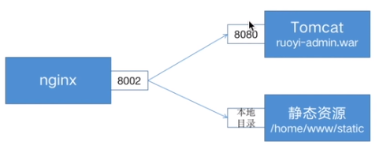
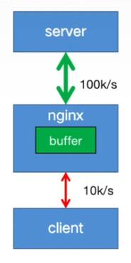
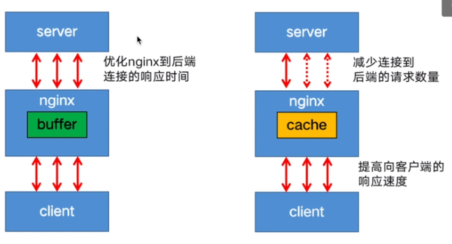

# 教程
- [nginx一小时入门](https://www.yuque.com/wukong-zorrm/cql6cz/uoz0cq)
# nginx三大功能
- 反向代理
- 动静分离
- 负载均衡
# 正向代理
- 客户端代理转发称为正向代理，如VPN
# 反向代理
- 服务端代理转发称为反向代理，如nginx
```
server{
    listen 8000;
    server_name localhost;

    location / {
        root D:/Users/chinalife/Documents/workspace/AdminLTE-3.2.0;
        index index.html index2.html index3.html; 
    }

    location /admin {
        # 实际访问目录是D:/Users/chinalife/Documents/workspace/AdminLTE-3.2.0/admin  但是这个目录不存在
        root D:/Users/chinalife/Documents/workspace/AdminLTE-3.2.0;
        index index.html index2.html index3.html; 
    }
}
```

```server {
  listen 8001;
  server_name ruoyi.localhost;
  location / {
    #nginx的主机地址
    proxy_set_header Host $http_host;
    #用户端真实的IP，即客户端IP
    proxy_set_header X-Real-IP $remote_addr;
    proxy_set_header X-Forwarded-For $proxy_add_x_forwarded_for;

    # 8001端口的访问会转发到8088
    proxy_pass http://localhost:8088;
  }
## 常用变量的值：
$host：nginx主机IP，例如192.168.56.105
$http_host：nginx主机IP和端口，192.168.56.105:8001
$proxy_host：localhost:8088，proxy_pass里配置的主机名和端口
$remote_addr:用户的真实IP，即客户端IP。

}
```
**X-Forwarded-For存储了客户端真实ip，X-Real-IP不是客户端ip是nginx服务器ip**


# 动静分离


# 缓冲 buffer
- 利用内存
- 不会减少对后端请求的数量，只是利用了nginx到后端的高速网络

```
location / {
    proxy_buffers 16 4k;
    proxy_buffer_size 2k;
    proxy_pass http://localhost:8088;
}
```
# 缓存 cache
- 将文件写入磁盘，请求相同的内容，直接去磁盘取
- 减少对后端请求的数量

```
http {
    proxy_cache_path /data/nginx/cache keys_zone=mycache:10m;
    server {
        proxy_cache mycache;
        location / {
            proxy_pass http://localhost:8000;
        }
    }
}
```

# 负载均衡
```
upstream ruoyi-apps {
    #不写，采用轮循机制
    server localhost:8080;
    server localhost:8088;
  
}

server {
  
  listen 8003;
  server_name ruoyi.loadbalance;
  
  location / {
    proxy_pass http://ruoyi-apps;
  }

}
```
## 负载均衡策略
- 轮询
- 最小连接：请求转发给空闲的服务器
  - **问题**：导致用户状态丢失
- iphash
  - 将一个用户的请求转发到固定的服务器
  - **问题**：上游服务器宕机或者扩容会重新计算hash，导致大量缓存失效
- hash
  - 启用一致性hash算法，最大程度减少缓存失效
- 随机
- 权重 
```
upstream my-server {
  
    server performance.server weight=3;
    server app1.server;
    server app2.server;

}
```
- 健康检查

# https